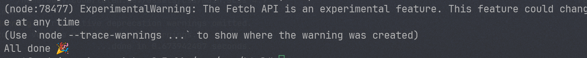
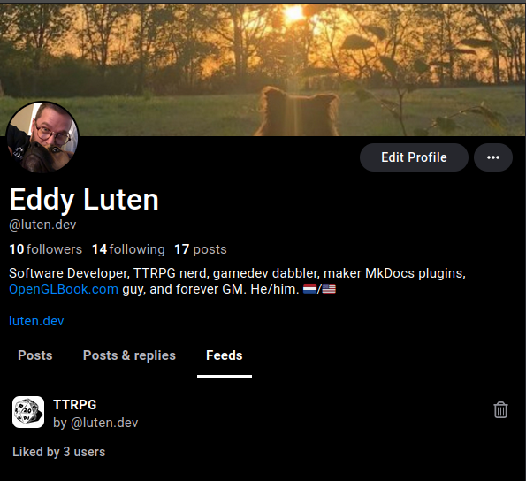

I was recently invited to join Bluesky, a new social media platform. This was mostly motivated by the nightmare that Twitter has become over the past year or so. One of Bluesky's nice features is the encouragement from the official team to build supplementary software. One way to do it is to build a custom feed. So, I set out to do just that: I built [a feed that serves all posts related to TTRPGs on Bluesky](https://bsky.app/profile/did:plc:56dp2st2pupnf7qsxko2qmmd/feed/ttrpg){:target="_blank"}. Here's how I went about publishing mine on a [DigitalOcean](https://m.do.co/c/3767385e180a){:target="_blank"} droplet using PM2, Nginx, and Let's Encrypt.

<!--more-->

_Step One_ is simply to [fork this example repo](https://github.com/bluesky-social/feed-generator){:target="_blank"} and follow the directions in the README.md file to get it up and running.

## Firehose Subscription

Once you have it all set up, head into `subscription.ts` and begin modifying its contents to fit your needs. This file receives the "firehose" of all new posts created on Bluesky, so you can create whatever arbitrary logic you wish to define right here. That's really all there is to it. I won't go into too much detail since you can explore the types exported by the packages, but it's easy to match on the following:

- `ops.posts.creates` is a list of all of the new posts created since the last poll
- `ops.posts.creates[n].record.text` is the actual full text of the new post
- `ops.posts.creates[n].author` is the author's unique ID on the platform

From here, you could for example perform some matching against the text and define an include or ban list based on the author ID.

## Sanitation

Once you've defined your feed's logic, you'll want to change the endpoint at which it serves. By default, there's a file named `whats-alf.ts` that defines the name and handler function for your feed. Rename the file to something that suits your needs better. There are two things exported from this file: a `shortname` variable that defines the name of the feed endpoint and the handler function for the feed. Change the `shortname` to something else more representative of your data.

## Exports

The file `index.ts` imports from the above file and exposes the endpoints served by your application. You'll want to update your imports here to point to your renamed file:

```typescript
// ... snip ...
import * as ttrpg from './ttrpg'

type AlgoHandler = (ctx: AppContext, params: QueryParams) => Promise<AlgoOutput>

const algos: Record<string, AlgoHandler> = {
  [ttrpg.shortname]: ttrpg.handler,
}

export default algos
```

You may need to restart the application if you're running it locally and change the browser URL to point to the new name.

## Running Remotely

Running a [Droplet on a DigitalOcean](https://m.do.co/c/3767385e180a){:target="_blank"} is the most affordable method I could find to run this (unless you have AWS credits to spare). I simply started the smallest instance available and used the Node.js template to get started. The machine image already comes with PM2, Git, and Nginx pre-installed.

If you enter your server's public IP address in your browsers, it will display the "Hello, World" app's output with a few useful links.

Once you have your machine up and running and SSH into it, you'll need to get your code there. I'll leave the details on how you accomplish this to you. But since Git comes pre-installed as well, it was easy enough for me to pull down my repo into the `/var/www/html` directory (web root), which is the default location that Nginx serves from. Don't forget to wipe the contents of that directory first to prevent conflicts. The machine image also comes with a dedicated SFTP user, so that's another option to get your code there.

## Removing the `hello` App

Now that your code lives in the web root, you'll want to stop and delete the "Hello World" app currently running:

```sh
sudo -u nodejs pm2 stop hello && sudo -u nodejs pm2 delete hello
```

Notice that the user who owns the PM2 process is `nodejs`, which is a pre-configured non-root user. We'll reuse this user in a bit for our own app.

## First Start

Before we begin, follow the [instructions to install Yarn](https://yarnpkg.com/getting-started/install) on your server. You'll need this to run the application.

Now, run the following commands from the web root:

```sh
yarn && yarn start
```

You should now have an identical feed to what you had on your local machine running on your public IP. Once verified, shut down the process with Ctrl+C.

## Adding the App to PM2

Manually running the process isn't a great idea since it will shut down the moment you close your SSH session. That's where PM2 and that `nodejs` user come in. Register your app with the following command:

```sh
sudo -u nodejs pm2 start yarn --name ttrpg-feed -- start
```
Substitute `ttrpg-feed` with whatever name you want. You'll use this to refer to the process managed by PM2 over time. Now run:

```sh
sudo -u nodejs pm2 status
```

You should see something that looks like this:


If your app isn't running, you can start it using this command:

```sh
sudo -u nodejs pm2 start ttrpg-feed
```

You can monitor the output of your feed using the following command:

```sh
sudo -u nodejs pm2 log
```

You'll want to save this command to troubleshoot issues.

## Setting up Your (Sub-)Domain

I run my feed on a custom subdomain, which is necessary for the next step: adding SSL connectivity. To do this, create a new A record in your DNS management tool that points to your Droplet's public IP address. Once set up, you should be able to view your feed on that subdomain over HTTP.

## Setting up SSL

One of the requirements of hosting a custom Bluesky feed is that it must be served using SSL on port 443, the default HTTPS port. To do this, we'll use Let's Encrypt.

DigitalOcean has [a detailed tutorial](https://www.digitalocean.com/community/tutorials/how-to-secure-nginx-with-let-s-encrypt-on-ubuntu-20-04){:target="_blank"} on how to do this, but I found that I only needed to do a few things since so much comes preconfigured on these Droplets.

Use your [favorite text editor](https://www.vim.org/){:target="_blank"} to modify the `server_name` entry of `/etc/nginx/sites-available/default` to match your subdomain.

Next, you'll need Certbot, which facilitates the process of getting an SSL cert, and the Nginx plugin for Certbot.

```sh
sudo apt install certbot python3-certbot-nginx
```

Once installed, restart Nginx:

```sh
sudo systemctl reload nginx
```

Now, let's generate the SSL certificate:

```sh
certbot --nginx -d my.domain.example
```

Once you get to this screen, pick the redirect option (2) to force all HTTP traffic to be converted to HTTPS:

```text
Please choose whether or not to redirect HTTP traffic to HTTPS, removing HTTP access.
- - - - - - - - - - - - - - - - - - - - - - - - - - - - - - - - - - - - - - - -
1: No redirect - Make no further changes to the webserver configuration.
2: Redirect - Make all requests redirect to secure HTTPS access. Choose this for
new sites, or if you're confident your site works on HTTPS. You can undo this
change by editing your web server's configuration.
- - - - - - - - - - - - - - - - - - - - - - - - - - - - - - - - - - - - - - - -
Select the appropriate number [1-2] then [enter] (press 'c' to cancel):
```

At this point, you should be able to view your feed using the HTTPS protocol since this process changes your Nginx configuration. If not, try restarting Nginx or your app.

## Preparing for Publishing

You may notice that your feed's URL still contains the sample `did` provided by the base GitHub repo. Let's ensure that once published, this feed is tied to our user.

To find your DID, [visit this URL](https://bsky.social/xrpc/com.atproto.identity.resolveHandle?handle=THE-USERNAME){:target="_blank"} and replace the username in the URL with your own.

Once you have your DID, create a `.env` file in your webroot and add the following lines, substituting the values for your own:

```text
FEEDGEN_PUBLISHER_DID="did:plc:YOUR-DID"
FEEDGEN_HOSTNAME="your.subdomain.example"
```

Restart your application using PM2 and substitute the DID in the URL for your own.

Please remember: do not commit your `.env` files!

The final step before publishing your feed to Bluesky is to modify the values in `scripts/publishFeedGen.ts` with your own. You should generate an App Password by visiting your Bluesky Settings screen and generating one there. The nice thing about App Passwords is that you can revoke them in case they become compromised. You don't want to compromise your main password!

There are more details in this file, and I'll leave filling them up to you, but please ensure not to commit your `password` entry to Git. Preferably, you'll want to place it in your `.env` file and pull it from there.

## Publishing

Once you're ready and you've verified that your feed is running using the correct DID, you're ready to publish your app to Bluesky:

```sh
yarn publishFeed
```

On success, you should see the following message:



Once published, you should see the feed show up under the "Feeds" tab on your profile:



## Persisting Data

By default, the feed uses an in-memory SQLite database. To persist data use persistent storage, such as a disk-based SQLite database. Add the following line to your `.env` file:

```text
FEEDGEN_SQLITE_LOCATION="db.sqlite"
```

Now when you restart your app, the feed should persist and you should see a `db.sqlite` file in your web root directory. If you're getting "readonly" errors, it means that the `nodejs` user isn't allowed to write to the database file. Use `chmod 777 db.sqlite` to allow the user to write to it.

I also recommend installing the SQLite command line tools so you can quickly query the database file:

```sh
apt install sqlite3
```

Finally, you'll want to create backups of these database files in case something goes wrong in your web root directory. The simplest way to do this is by setting up a cron job that copies the `db.sqlite` file to another location on a timer.

The simplest (and least secure) way to do this is by using a cron job to copy the files to another directory. Since none of the data in these databases is critical, I'm fine with using this solution. This is the backup script I created, saved as `~/db-backup.sh`:

```sh
#!/bin/sh
DATE=$(date -I)
cp /var/www/html/db.sqlite "/root/db-backups/$DATE.db.sqlite"
```

Save it, then make it executable:

```sh
chmod +x ~/db-backup.sh
```

Create the directory where the files will live:

```sh
cd ~ && mkdir db-backups
```

Now, we schedule it to run at midnight every day. Run `crontab -e` and add the following schedule to the file:

```cron
0 0 * * * /root/db-backup.sh
```

It might be worth it to have a dedicated DB server to store the data if you're getting serious traffic, but since this thing is a toy, SQLite works for me.

## Final Thoughts

The easiest part of this entire process was writing the code. Setting up a server and getting the feed hosted correctly was quite tedious, so I hope this helps you out and points you in the right direction.
